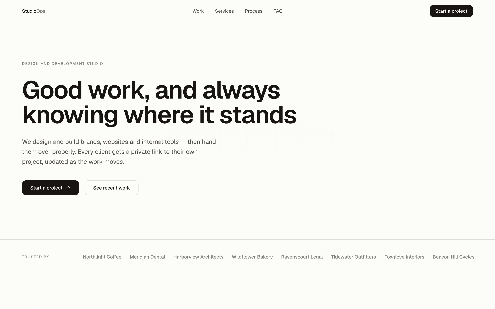
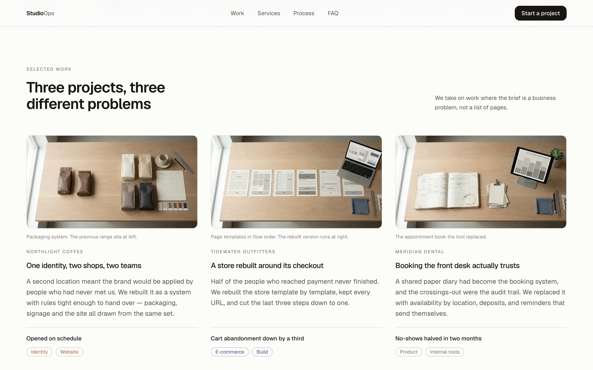
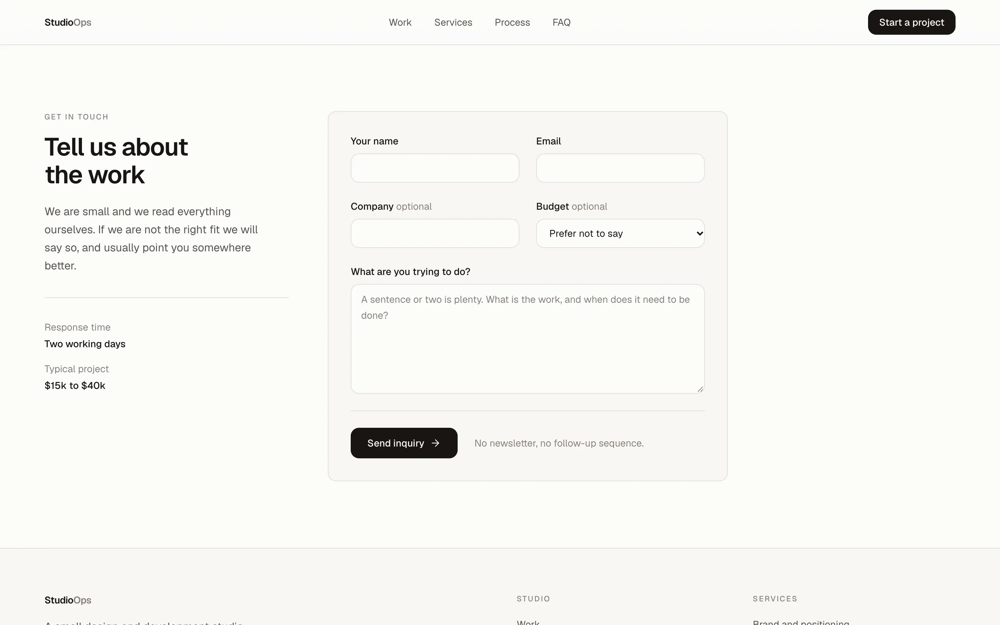
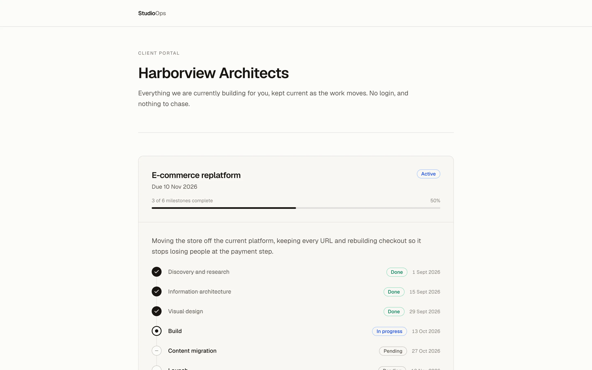
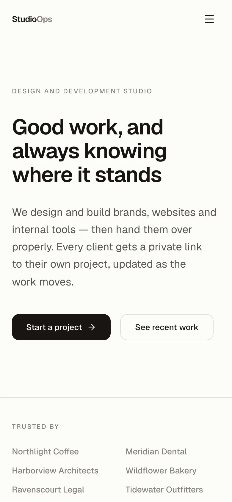
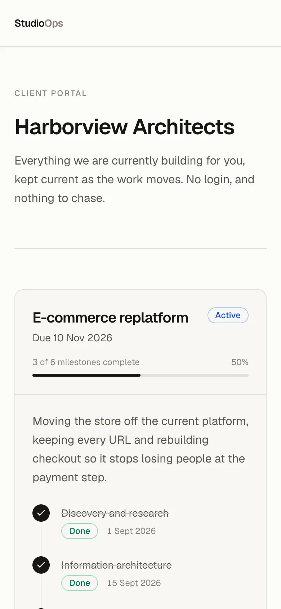

# StudioOps — public site and client portal

The client-facing half of StudioOps: a one-page site with an inquiry form, and
a private portal where a client follows their own project.

Data and business logic live in
[`studio-ops-api`](https://github.com/artem-shap/studio-ops-api) (Laravel 13). There is no database here,
no ORM and no business rules.

> **Live:** https://studio-ops-web.vercel.app
> **A real client portal:** https://studio-ops-web.vercel.app/portal/0077b0a101698ee591543835d381ac74606d0c93ba022518d120c85b5fbd1d9a
> **Admin panel:** https://studio-ops-api-6nny.onrender.com — `demo@studioops.dev` / `studioops`
>
> The API behind the portal is hosted on a free tier that suspends after fifteen
> idle minutes, so the portal's first load after a quiet spell takes about a
> minute. The landing page is static and unaffected — verified by serving it
> with the API stopped entirely.

## What it looks like





The inquiry form. Submitting it runs a Server Action that validates with Zod,
rate-limits by IP and forwards the inquiry to the API; it lands in the admin
panel's inbox.



The client portal: what a client sees behind their private link. No login,
their own projects only, with every milestone and its status.



<p>
  
  &nbsp;
  
</p>

The portal screenshots are taken against a freshly seeded demo, so the dates
are relative to the day they were taken.

## Architecture boundary

```
browser  ->  Server Action / route handler  ->  studio-ops-api
```

The browser talks only to the Next.js server, which is the only thing holding
the API credential. Nothing here ever fetches the API from a client component,
`STUDIO_API_KEY` is never prefixed `NEXT_PUBLIC_`, and the portal token never
appears in a browser network request.

The reasoning, and eleven other decisions, are in
[the API repository's DECISIONS.md](https://github.com/artem-shap/studio-ops-api/blob/main/DECISIONS.md).

## Stack

Next.js 16 (App Router) · React 19 · TypeScript strict · Tailwind 4 · Zod ·
Lucide · Vitest

## Running it locally

```bash
pnpm install
cp .env.example .env.local    # point STUDIO_API_URL at a running studio-ops-api
pnpm dev
```

| Variable | Scope | Purpose |
|---|---|---|
| `STUDIO_API_URL` | server only | base URL of `studio-ops-api` |
| `STUDIO_API_KEY` | server only | shared secret sent as `X-Studio-Key` |

Both are validated with Zod at module load, so a missing value fails at boot
rather than as a confusing 401 on someone's first submission.

## Tests

```bash
pnpm test        # Vitest
pnpm lint
pnpm typecheck
pnpm build
```

The inquiry schema is tested against the exact limits its Laravel counterpart
enforces, including the 2000-character boundary. If the two ever disagree a
visitor passes client validation and then fails on the server, so the boundary
is pinned on both sides.

## Notable pieces

| | |
|---|---|
| `src/lib/api/client.ts` | Allows 60 seconds and retries once, because the API host suspends when idle |
| `src/lib/schemas/inquiry.ts` | One schema, imported by the form and the Server Action |
| `src/app/actions.ts` | Rate limits by IP, then hands off; upstream errors are logged, never shown |
| `src/app/portal/[token]/page.tsx` | `force-dynamic`, `noindex`, and one identical 404 for invalid, expired and revoked tokens |
| `src/components/InquiryForm.tsx` | The only client component on the site |

## Working with AI

Built with Claude Code, deliberately. The process is in
[CONTRIBUTING.md](CONTRIBUTING.md); [AI-NOTES.md](AI-NOTES.md) records where the
generated output was wrong and the commit that fixed it — including a root
`loading.tsx` that quietly turned every `notFound()` into a 200.
